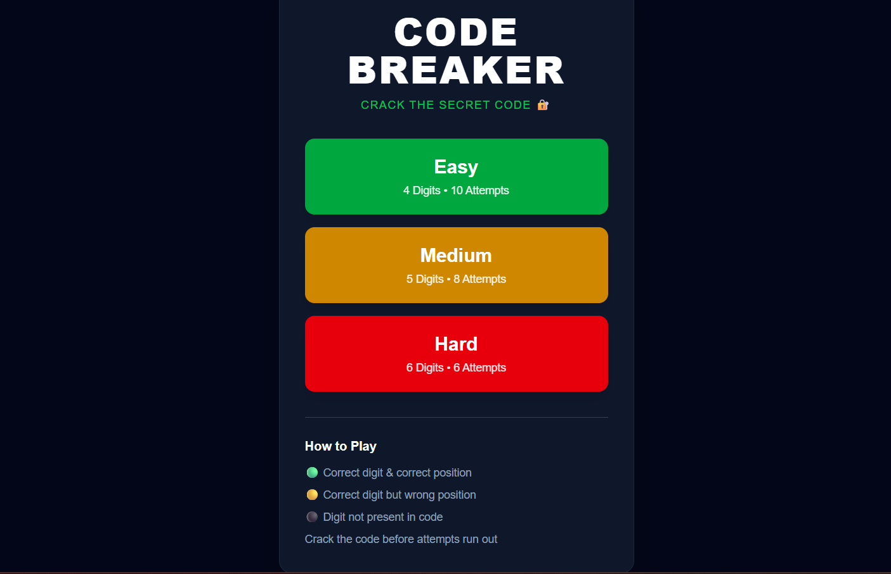
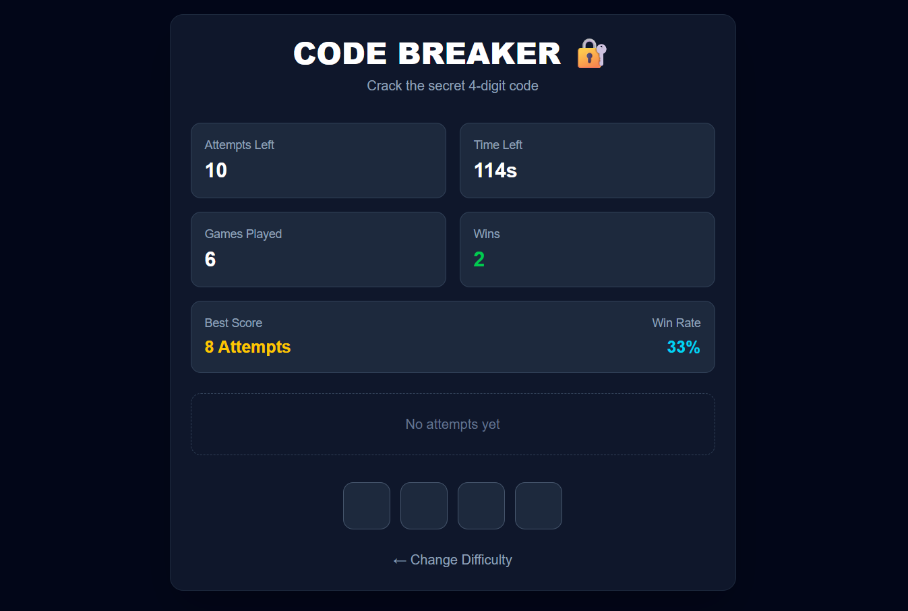
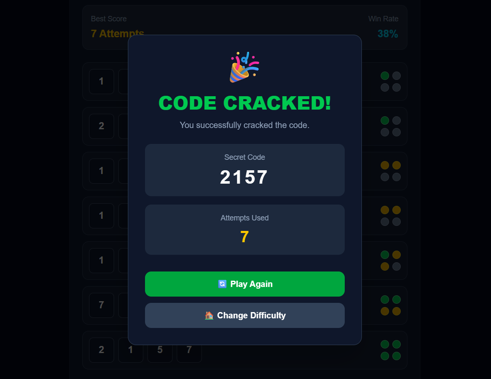

# 🎯 CodeBreaker - Mastermind Game

A modern implementation of the classic **Mastermind** game built using **React** and **Vite**. The objective is to guess the secret color code within a limited number of attempts using logical deduction.

---

## 🚀 Features

* 🎮 Interactive Mastermind gameplay
* 🎚️ Multiple difficulty levels
* 📊 Game statistics
* 🏆 Win/Lose modal
* 🔄 Restart game functionality
* ⚡ Fast and responsive UI
* 📱 Mobile-friendly design

---

## 🛠️ Tech Stack

* React
* Vite
* JavaScript (ES6+)
* CSS

---

## Screenshots









## 📂 Project Structure

```text
CODEBREAKER/
│
├── src/
│   ├── components/
│   │   ├── AttemptRow.jsx
│   │   ├── DifficultyScreen.jsx
│   │   ├── GameBoard.jsx
│   │   ├── StatsCard.jsx
│   │   └── WinLoseModal.jsx
│   │
│   ├── utils/
│   │   └── mastermind.js
│   │
│   ├── App.jsx
│   ├── App.css
│   ├── index.css
│   └── main.jsx
│
├── public/
├── package.json
├── vite.config.js
└── README.md
```

---

## 🎯 How to Play

1. Choose a difficulty level.
2. Try to guess the hidden color combination.
3. After each guess, feedback is provided:

   * ✅ Correct color in the correct position.
   * 🟡 Correct color in the wrong position.
   * ❌ Color not present in the secret code.
4. Use the feedback to narrow down the possibilities.
5. Guess the correct code before running out of attempts.

---

## ⚙️ Installation

Clone the repository:

```bash
git clone https://github.com/aditya25666/CODEBREAKER.git
```

Navigate to the project folder:

```bash
cd CODEBREAKER
```

Install dependencies:

```bash
npm install
```

Start the development server:

```bash
npm run dev
```

Build for production:

```bash
npm run build
```

Preview the production build:

```bash
npm run preview
```

---


## 💡 Future Improvements

* Dark/Light theme
* Timer mode
* Hint system
* Multiplayer mode
* Leaderboard
* Sound effects
* Animations
* Local storage for statistics

---

## 👨‍💻 Author

**Aditya Ingle**

GitHub: https://github.com/aditya25666

---

## 📄 License

This project is licensed under the MIT License.
